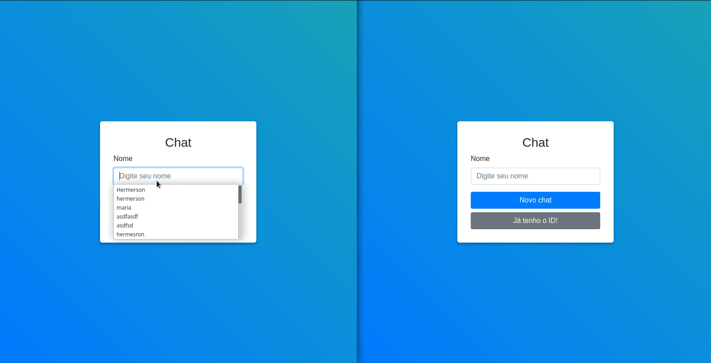

## Uso

- Instale todas as dependências:
```yarn```
- Execute o comando:
```yarn start```


## Backend
A backend desse frontend se encontra nesse repositório :point-left: https://github.com/hdev14/chat-backend
